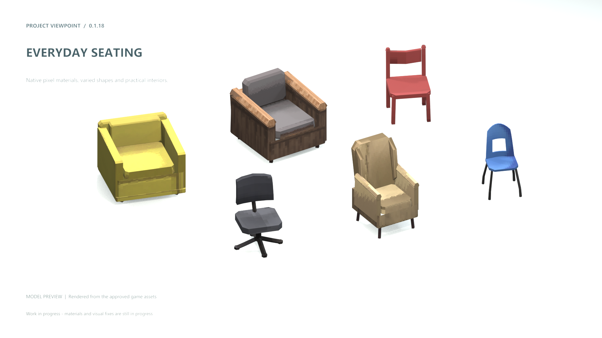
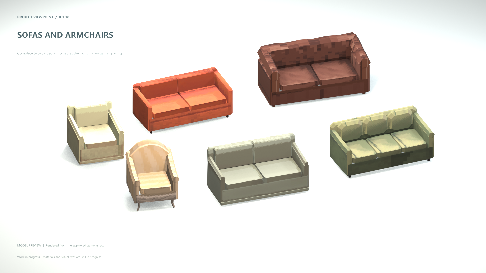
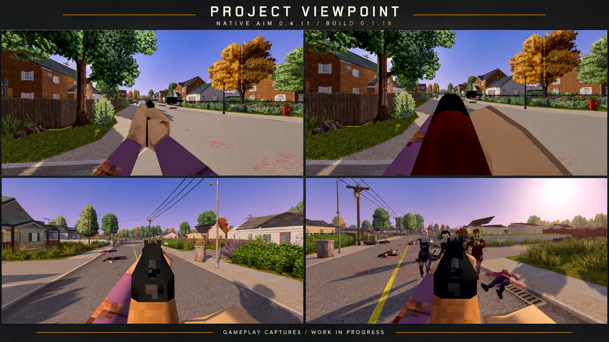

# Project ViewPoint — 3D Models & Native Aim

**Build 42.21 · 3D Models 0.1.18 · Native Aim 0.4.11 · dois mods separados na Steam**

[3D Models — Steam Workshop](https://steamcommunity.com/sharedfiles/filedetails/?id=3811400314) · [Native Aim — Steam Workshop](https://steamcommunity.com/sharedfiles/filedetails/?id=3813269725) · [Como funciona a separação](Docs/MOD-SPLIT.md)

O **3D Models** reúne os modelos de interiores e exteriores. O **Native Aim** oferece alinhamento da mira em primeira pessoa, movimento, respiração e coice. Cada um pode ser ativado sem o outro; ambos continuam dependendo do Viewpoint e do ZombieBuddy. Este repositório mantém as duas partes para colaboração.

Quem já usava a mira no pacote antigo deve assinar o novo item **Native Aim** e ativar `ViewpointADSTest` no jogo. O item antigo passa a distribuir somente o **3D Models**, com o mesmo ID `ViewpointFurnitureFix`. [Instruções de migração](Docs/MOD-SPLIT.md#para-quem-já-usava-o-pacote-completo).

[Notas completas da 0.1.18](Docs/PATCH-0.1.18.md) · [Validação offline](Docs/Build-0.1.18-Validation.json)

**Em desenvolvimento:** muitos modelos já estão no jogo, mas ainda não têm as texturas prontas. Alguns modelos continuam com defeitos visuais. Seguimos revisando modelos e materiais e investigando correções de renderização que envolvem o próprio Viewpoint. Os problemas restantes de telhados, paredes e aparelhos HVAC estão registrados; esta versão não promete corrigir todos os prédios do mapa. Ainda não houve nova medição de FPS em gameplay desta build.

Projeto de colaboração mantido por Hiro.uou (conta GitHub `Hirouou`). O catálogo integrado de Interiors registra **2.284 arquivos de modelos e 2.335 ligações de sprites**; os modelos e fontes estão em `Scripts/Interiors`. A biblioteca de pintura UV, separada desse catálogo completo, contém **603 modelos** com mapas de textura e guias para colaboração.

## 3D Models — galeria da 0.1.18

| Cadeiras e poltronas | Sofás e poltronas |
| --- | --- |
|  |  |

Imagens aprovadas pelo autor. As prévias de móveis foram renderizadas diretamente dos assets reais no Blender, mantendo suas texturas. Texturas e correções visuais continuam em andamento. [Origem e método das imagens](Media/0.1.18/README.md).

## Native Aim — mod de mira

[Assinar Native Aim na Steam](https://steamcommunity.com/sharedfiles/filedetails/?id=3813269725)

Montagem aprovada de capturas reais de gameplay. O Native Aim preserva as ações nativas do personagem e permite comparar o alinhamento com **F7**. A separação mantém a versão 0.4.11 da mira. [Código e limitações do snapshot para colaboração](Scripts/NativeAim/README.md).

## Código do projeto

- [Sistema de mira nativa](Scripts/NativeAim/README.md): fontes Java, controle Lua e calibrações para propor ajustes de alinhamento, movimento, respiração e coice.
- [Integração dos interiores](Scripts/Interiors/README.md): fontes Java e controle Lua para os modelos e estados dos objetos.
- [Preparação e compilação](Docs/DEVELOPMENT.md): dependências externas e compilação dos dois módulos, sem caminhos pessoais ou instalação automática.

Este repositório é uma base de desenvolvimento e revisão, não uma cópia da instalação do jogo nem um pacote pronto para substituir a versão da Steam. A biblioteca UV ainda precisa de integração e revisão em jogo. Arquivos do Project Zomboid, Viewpoint e ZombieBuddy não são redistribuídos aqui.

## Encontrar e pintar um modelo

Abra [a galeria pesquisável de UVs](Docs/UV-GALLERY.html) e busque pelo ID. Cada cartão abre o guia visual daquele modelo. O arquivo de pintura correspondente fica em `textures/PNG/<id>_UV.png`; o modelo fica em `models/<id>.obj` e seu MTL em `Materials/<id>.mtl`.

Para pintar, mantenha o nome e a resolução do PNG. Cada mapa já começa com a textura que o modelo usa no mod, remapeada para as UVs organizadas, e pode ser editado no Aseprite. O guia `textures/UV-Guides/<id>_UV-Guia.png` identifica os contornos e as ilhas. Os dois rádios `pz_house_makeshift_ham` e `pz_house_makeshift_radio` foram reservados para retrabalho e não fazem parte desta revisão.

## Ver no Blender

Abra `models/ProjectViewPoint-UV-Library-Surfaces.blend`. A biblioteca contém os 603 modelos organizados em coleções por lote. Para atualizar o modelo após salvar um PNG, execute `Scripts/Reload-UV-PNGs.py` uma vez pelo editor de texto do Blender; as imagens são recarregadas automaticamente.

O índice em [Docs/UV-INDEX.csv](Docs/UV-INDEX.csv) facilita filtrar por nome. [Docs/UV-MANIFEST.json](Docs/UV-MANIFEST.json) registra resoluções e hashes. [Docs/UV-WORKFLOW.md](Docs/UV-WORKFLOW.md) explica o fluxo completo.

## Arquivos e direitos

A biblioteca contém 603 OBJ, 603 MTL, 603 mapas PNG, 603 guias UV e uma cena Blender editável. Hiro.uou confirmou a autoria original dos modelos e mapas e autorizou sua publicação para colaboração no Project ViewPoint. Projetos Aseprite/Zprite, backups e folhas-fonte do jogo não fazem parte deste pacote.

**© 2026 Hiro.uou. Todos os direitos reservados / All Rights Reserved.** A [licença](LICENSE.md) permite consultar, baixar, criar forks e editar os arquivos para propor melhorias ao mod por Pull Request. Reutilização em outro mod, jogo, projeto ou produto, venda e redistribuição independente exigem autorização prévia por escrito. Contribuições seguem o [guia de contribuição](CONTRIBUTING.md).

O pacote serve para revisão e colaboração. A integração no mod e qualquer atualização do Steam Workshop dependem da aprovação do mantenedor.

## Como enviar melhorias sem alterar a biblioteca oficial

Crie um **fork** (uma cópia na sua própria conta), faça as alterações em uma branch dessa cópia e abra um **Pull Request** para este repositório. Sua proposta aparece na aba **Pull requests**, separada dos arquivos oficiais, para Hiro.uou revisar, pedir ajustes, aceitar ou recusar.

Abrir um Pull Request não altera a branch `main`. Somente Hiro.uou aprova e incorpora as mudanças; colaboradores da comunidade não recebem acesso direto de escrita ao repositório oficial. Até a aprovação e incorporação, quem baixar a biblioteca oficial continuará recebendo a versão do mantenedor.

## Comunidade

Converse sobre contribuições e acompanhe o projeto no [Discord do Project ViewPoint](https://discord.gg/ME53neUunA).

Se quiser apoiar o desenvolvimento, visite o [Ko-fi do estúdio](https://ko-fi.com/chocomilkestudio).
